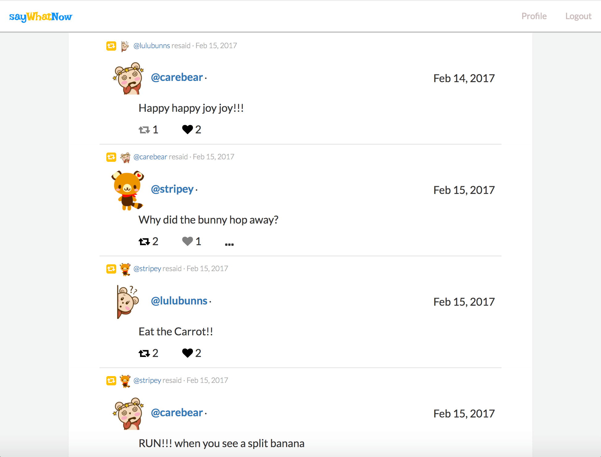
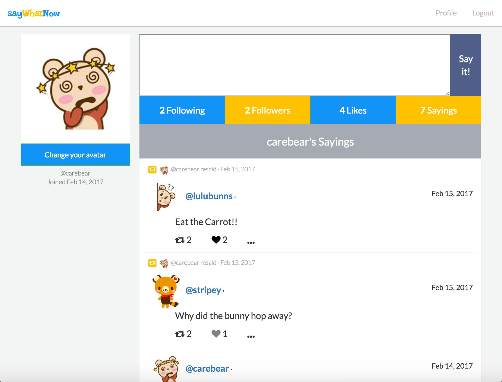
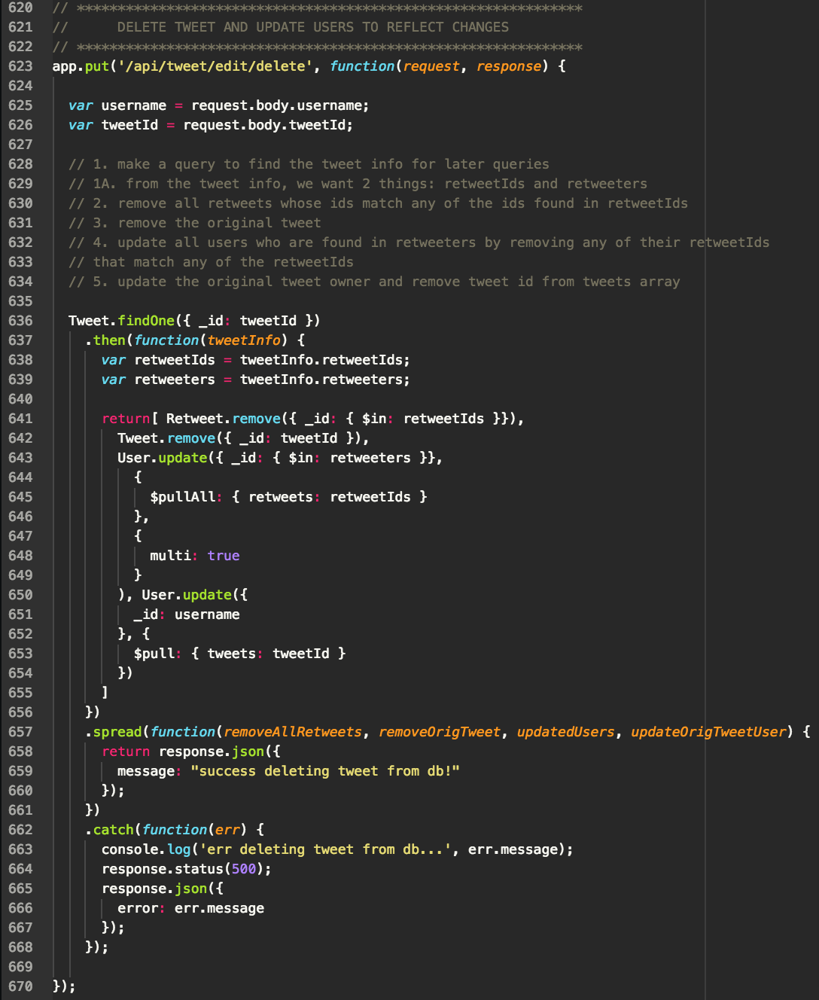
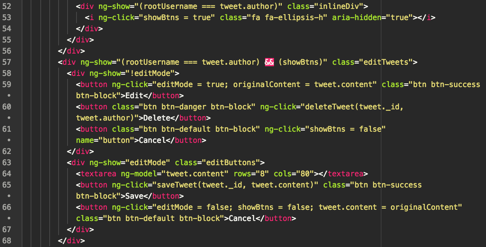

# SayWhatNow (Twitter Clone)

### Objective:

create a twitter clone app, utilizing the Mean Stack, where users can post tweets, retweet tweets, like tweets, follow/ unfollow users, and upload avatars

### Live Demo:

[SayWhatNow](http://www.saywhatnow.life/)

### Credits

Carolyn Lam

### Technologies used in the Front-end:

* Html
* Css
* JavaScript
* AngularJS

### Technologies used in the Back-end:

* Express
* NodeJS
* MongoDB

### Screenshots

##### Home
  

##### Profile

  

###  Challenges:

###### Example 1 (MongoDB Schema Design)

  Initially, I started with 2 schemas, Tweet and User. Later on when adding more functionality, I added a File schema for the main purpose of giving users the ability to upload files to be used as their avatars. Lastly, I added a Retweet schema. When designing it, there were several questions I asked myself, such as 'What do I want to accomplish?'. Even better, was being more specific with what I wanted to achieve, and asking myself, 'How does it connect to other schemas?'. The latter would prove to be extremely helpful.

  In hindsight, understanding my end goals better would have saved me a lot of time, for I ended up redesigning my schemas often upon adding a retweet functionality. After I would choose a certain design, I would then encounter issues that could only be resolved with a better design. For example, at one point, I decided my project didn't need a Retweet schema, and for my purposes, having a Tweet schema would work fine. Then in the front end, when rendering content, I realized there was more information I wanted to render on the pages that my current design couldn't offer, such as showing the date the retweet was made. So then I decided it was simpler to have two different schemas, in which I had the Retweet reference the Tweet schema and where each had its own date property.

  One of my other end goals, associated with the retweet functionality, was the ability to show both the tweet and the retweeter's avatars on the page. The easier approach it seemed was to give them each a property that would store the filename. However, I decided not to use that approach because this value was already a value stored in the User schema and I didn't want to waste space for a value we already had. I ended up instead making queries for the avatars and then linking them up with the correct tweet or retweet user.

###### Example 2 (Server Issue: Encountering 502 and 503 Proxy Errors when uploading files)

  This is by far proving to be the biggest challenge and is currently still in the process of being resolved. To address this issue, I have modified the config file by adding several directives related to the proxy. I have also consulted the help of another developer. Hopefully, I will solve this server issue soon and then share my findings.

  Update on Findings

  * I want to say... maybe 1.5 months ago.. Time has really flown. Well, I ended up going to back to DC and getting help from my instructor Toby. It turned out to be a far bigger issue than I had imagined. After much debugging, Toby realized that there was a bug with Multer and that pm2 wasn't working. He suggested finding an alternative to pm2 and we decided on using forever instead. Amazingly, it now works. Uploading files is now a breeze. Thank you Toby!

###  Code Snippets

###### Back-end Examples:

  

###### Front-end Examples:

  

  The above code snippet example is from the world timeline page. Line 53 shows an ellipsis from fontawesome.io. This ellipsis only appears if the user logged in is the author of the tweet. Upon clicking it, we then assign the variable 'showBtns' the value of true (a boolean). Then on line 57, this div shows when it meets these two conditions: 1) the logged in user is the author of the tweet and 2) showBtns's value is true. When met, there are 2 child divs. One div shows only if the value of editMode is false, while the other div shows when the value of editMode is true. At this point, editMode is not set, so the default value is false.

  The child div that only shows when editMode is false is rendered on the page. Inside this div, there are 3 child nodes: 1) edit button, 2) delete button, and 3) cancel button. If the user clicks the edit button, we update the value of editMode to true and assign the value of the tweet to a variable called originalContent. So, what is happening here is that, now that value of editMode has changed to a value of true, the parent div, along with its child nodes, no longer show. And instead, the other div with an ng-show of editMode set to true shows on the page. Also, we assign the tweet's content to originalContent to store the original tweet's content in case later on, if the user decides to cancel any edits, we can reassign the original content back to the tweet.

  Had the user not clicked on the edit button, and instead clicked on the delete button, the tweet would have been deleted. And had it been the cancel button, the value of showBtns would have been updated to false, which means, its parent div, along with its siblings nodes, no longer appear on the page.

  However, had the user clicked on the edit button, the other div with an ng-show of 'editMode' set to true renders on the page (line 63). Inside this div are 3 other nodes: 1) textarea with an ng-model of 'tweet.content' (the tweet's content), 2) save button, and 3) cancel button. At this point, the user can modify the textarea by adding or deleting from it. If the user clicks the save button, the tweet's content (whether modified or not) is sent to the back-end to be updated. If the user clicks on the cancel button, the value of 'editMode' is updated to false, 'showBtns' is assigned the value of false, and 'tweet.content' is assigned the value of 'originalContent'. What is happening here is that we revert to the default settings, where 'showBtns' and 'editMode' have a value of false because we are no longer editing or showing any buttons. Also, we have returned the tweet's original content back to itself.

### History

Project started: 1/19/2017

Project functionality completion: 1/24/2017

Project design started: 2/9/2017

Project design completion: 2/13/2017

Project deployed: 2/14/2017
